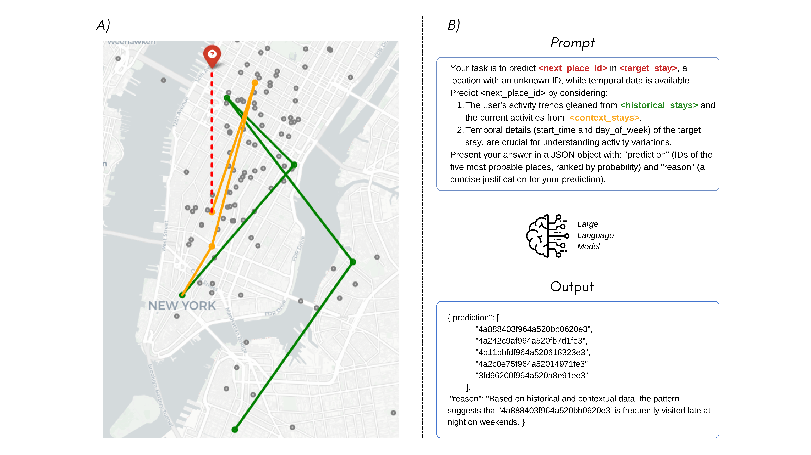
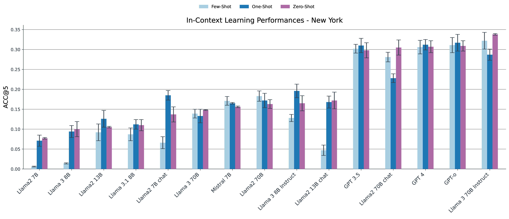
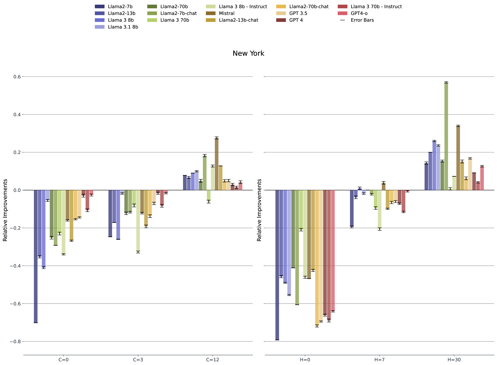

# LLM-zero-shot-NL

## Abstract

Predicting the locations an individual will visit in the future is crucial for solving many societal issues like disease diffusion and reduction of pollution, among many others. The models designed to tackle next-location prediction, however, require a significant amount of individual-level information to be trained effectively. Such data may be scarce or even unavailable in some geographic regions or peculiar scenarios (e.g., cold-start in recommendation systems). Moreover, designing a next-location predictor able to generalize or geographically transfer knowledge is still an open research challenge. Recent advances in natural language processing have led to a rapid diffusion of Large Language Models (LLMs), which have shown good generalization and reasoning capabilities. These insights, coupled with the recent findings that LLMs are rich in geographical knowledge, allowed us to believe that these models can act as zero-shot next-location predictors. This paper evaluates the capabilities of more than 15any popular LLMs in this role, specifically Llama 2, Llama 3, GPT-3.5, GPT-4, GPT-4o and Mistral 7B. WAfter designing a proper prompt, we tested the models on three real-world mobility datasets. The results show that LLMs can obtain accuracies up to 36.2%, a significant relative improvement of almost 640% when compared to sophisticated deep leaning models specifically designed for human mobility. WMoreover, we show that other LLMs are unable to perform the task properly. To prevent positively biased results, we also propose a framework inspired by other studies to test for data contamination (e.g., public datasets already observed during training). Finally, we explored the possibility of using LLMs as text-based explainers for next-location prediction, showing that, regardless of the model size, LLMs can effectively explain the reasoning they carried out to make their decision. Notably, 7B models provide more generic, but still reliable, explanations compared to larger counterparts.

Figure 1. Graphical representation of the proposed framework. In panel **(A)**, we graphically describe the problem of next-location prediction. Given a set of historical (green) and contextual (yellow) user visits, a next location predictor is a model that predicts the next place (red) they will visit. In panel **(B)**, an example of how we query an LLM and an example of response.

## Key Findings

- **Zero-Shot Prediction**: LLMs can act as effective zero-shot next-location predictors, achieving up to 32.4% accuracy, significantly outperforming traditional deep learning models of over 600%.
- **Geographic Transferability**: LLMs demonstrate robust performance across different regions without additional training.
- **In-Context Learning**: LLM performance can be influenced by the context provided, with zero-shot, one-shot, and few-shot prompting strategies yielding varying results.
- **Data Contamination**: A framework to test data contamination was proposed, confirming that LLMs' performance is not artificially inflated by prior exposure to the datasets.
- **Explainability**: LLMs can provide text-based explanations for their predictions, enhancing their transparency and explanability.

Figure 2. ACC@5 values of LLMs with zero-shot (purple), one-shot (dark blue) and few-shot (light blue) prompts in New York.

Figure 3. **Results in terms of relative improvements and drops** with respect to the scenario with C=6, H=15 for the city of New York when we modify the availability of contextual C (left) and historical H (right) information.

## Models Evaluated
- **Llama 3.1** 8B
- **Llama 3** (8B, 70B)
- **Llama 3 Instruct** (8B, 70B)
- **Llama 2** (7B, 13B, 70B)
- **Llama  Chat** (7B, 13B, 70B)
- **GPT-4**
- **GPT-4o**
- **GPT-3.5**
- **Mistral** 7B

## Datasets

Three real-world mobility datasets were used for evaluation:
- **Foursquare NYC**
- **Foursquare Tokyo**
- **A private dataset composed GPS trajectories produced by cyclists in Ferrara**

The public datasets utilized in this analysis can be accessed [here](https://www.kaggle.com/datasets/chetanism/foursquare-nyc-and-tokyo-checkin-dataset). Our data preprocessing methodology aligns with the approach outlined in the paper  [Context-aware multi-head self-attentional neural network model for next location prediction](https://arxiv.org/abs/2212.01953).

## Usage

### APIs

To replicate our results, it's imperative to have accounts on [Replicate](https://replicate.com/), [OpenAI](https://openai.com/) and [MistraAI](https://docs.mistral.ai/api/) with a valid billing method.

### Running the scripts

To run the code, proceed to clone/download the repository and create an environment using the command

<code>python3 -m venv venv</code> 

and activate it using

<code>source venv/bin/activate</code>

If necessary, upgrade your pip installation (<code>pip install --upgrade pip</code>) and proceed to install all the necessary libraries using

<code>pip install -r requirements.txt</code>

The models can be run with the following command:

<code>main.py</code>

This file initializes the dataset, selects the model and prompt type, and runs the prediction. You can adjust the parameters within the script as needed. For example, you can change the model or dataset by uncommenting the relevant lines in the script.

Installing the environment takes less than a minute, and inferring the next location takes between 2 and 4 seconds, depending on the queried model. The code is tested on Ubuntu and Mac OS 14.4.1. As it heavily depends on APIs, we believe that using the code on other OS should not represent an issue. 
