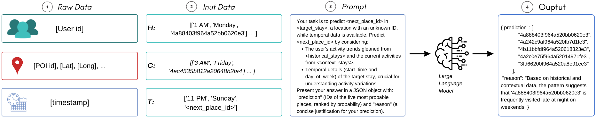
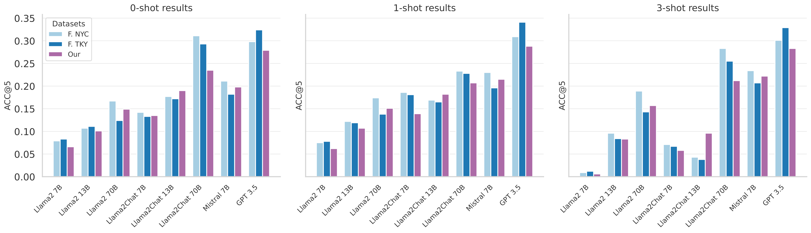

# LLM-zero-shot-NL

## Abstract

Predicting the locations an individual will visit in the future is crucial for solving many societal issues like disease diffusion and reduction of pollution among many others. The models designed to tackle next-location prediction, however, require a significant amount of individual-level information to be trained effectively. Such data may be scarce or even unavailable in some geographic regions or peculiar scenarios (e.g., cold-start in recommendation systems). Moreover, the design of a next-location predictor able to generalize or geographically transfer knowledge is still an open research challenge. Recent advances in natural language processing have led to a rapid diffusion of Large Language Models (LLMs) which have shown good generalization and reasoning capabilities. These insights, coupled with the recent findings that LLMs are rich in geographical knowledge, allowed us to believe that these models can act as zero-shot next-location predictors. This paper evaluates the capabilities of many popular LLMs in this role, specifically Llama2, Llama2 Chat, GPT-3.5 and Mistral 7B. After designing a proper prompt, we tested the models on three real-world mobility datasets. The results show that LLMs can obtain accuracies up to 32.4\%, a significant relative improvement of over 600\% when compared to sophisticated deep leaning models specifically designed for human mobility. Moreover, we show that other LLMs are unable to perform the task properly. To prevent positively biased results, we also propose a framework inspired by other studies to test data contamination (e.g., public datasets already observed during training). Finally, we explored the possibility of using LLMs as text-based explainers for next-location prediction showing that, regardless of the model size, LLMs can effectively provide an explanation for their decision. Notably, 7B models provide more generic, but still reliable, explanations compared to larger counterparts. The code is available as a supplementary file and will be available on GitHub after the review process.

Figure 1. Graphical representation of the proposed framework.

## Key Findings

- **Zero-Shot Prediction**: LLMs can act as effective zero-shot next-location predictors, achieving up to 32.4% accuracy, significantly outperforming traditional deep learning models of over 600\%.
- **Geographic Transferability**: LLMs demonstrate robust performance across different regions without additional training.
- **In-Context Learning**: LLM performance can be influenced by the context provided, with zero-shot, one-shot, and few-shot prompting strategies yielding varying results.
- **Data Contamination**: A framework to test data contamination was proposed, confirming that LLMs' performance is not artificially inflated by prior exposure to the datasets.
- **Explainability**: LLMs can provide text-based explanations for their predictions, enhancing their transparency and explanability.

Figure 2. ACC@5 Performance Comparison: LLMs vs. Traditional Models (Zero-Shot). 

Figure 3. ACC@5 of selected LLMs prompted to perform zero-shot (left), one-shot (middle) and 3-shot (right) next location prediction. 

## Models Evaluated

- **Llama2** (7B, 13B, 70B)
- **Llama2 Chat** (7B, 13B, 70B)
- **GPT-3.5**
- **Mistral 7B**

## Datasets

Three real-world mobility datasets were used for evaluation:
- **Foursquare NYC**
- **Foursquare Tokyo**
- **A private dataset composed GPS trajectories produced by cyclists in an Italian city**

The public datasets utilized in this analysis can be accessed [here](https://www.kaggle.com/datasets/chetanism/foursquare-nyc-and-tokyo-checkin-dataset). Our data preprocessing methodology aligns with the approach outlined in the paper  [Context-aware multi-head self-attentional neural network model for next location prediction](https://arxiv.org/abs/2212.01953).

## Usage

### APIs

To replicate our results, it's imperative to have accounts on both [Replicate](https://replicate.com/) and [OpenAI](https://openai.com/) with a valid billing method.

### Running the scripts

The models can be run with the following command:

<code>main.py</code>

This file initializes the dataset, selects the model and prompt type, and runs the prediction. You can adjust the parameters within the script as needed. For example, you can change the model or dataset by uncommenting the relevant lines in the script.